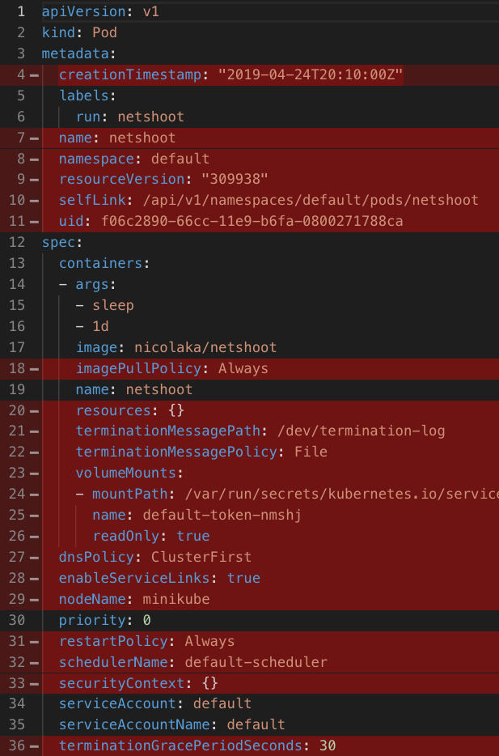

# kubectl-neat

Clean up Kubernetes yaml and json output to make it readable.

## Demo

Here is a result of a `kubectl get pod -oyaml` for a simple Pod. The lines marked in red are considered redundant and will be removed from the output by kubectl-neat.



## Why

When you create a Kubernetes resource, let's say a Pod, Kubernetes adds a whole bunch of internal system information to the yaml or json that you originally authored. This includes:

- Metadata such as creation timestamp, or some internal IDs
- Fill in for missing attributes with default values
- Additional system attributes created by admission controllers, such as service account token
- Status information

If you try to `kubectl get` resources you have created, they will no longer look like what you originally authored, and will be unreadably verbose.   
`kubectl-neat` cleans up that redundant information for you.

## Usage

Before installing, make sure you have the required [dependendies](#dependencies).

### kubectl plugin - Comming soon to krew

> kubectl-neat is not on krew (kubectl plugin manager) yet but can be manually added as kubectl plugin 

The easiest way is to add kubectl-neat as a kubectl plugin:
[https://kubernetes.io/docs/tasks/extend-kubectl/kubectl-plugins/](https://kubernetes.io/docs/tasks/extend-kubectl/kubectl-plugins/)

Once installed, any `kubectl get` command can be replaced by `kubectl neat`. For example:

```
kubectl neat pod mypod
kubectl neat svc myservice -o json
```

Any valid option that `kubectl get` accepts should be usable here.

### standalone executable

If you don't want to use as kubectl plugin, you can `kubectl get` the resources as you normally would do, and then pipe into `kubectl-neat` executable.

Then use by piping into:

```
kubectl get pod mypod -o yaml | kubectl-neat
kubectl get service myservice -o json | kubectl-neat
```

### Output format

The scripts support both json and yaml as output formats. Output format can be specified using a shell variable named `KUBECTL_OUTPUT` or by the familiar `-o` and `--output` options.  
When both are specified, the explicit flag takes precedence over the shell variable.  
If unspecified, output will default to yaml.

```
kubectl get service myservice -o json | KUBECTL_OUTPUT=json kubectl-neat
```

## Design

### Dependencies

The scripts are built using, and require the following dependencies:

- jq
- yq
- sponge (from moreutils)

### Design choices

This tool has evolved over time from a simple jq script, to a collection of jq scripts, to an additional Go utility, and so on. Perhaps this seems like overuse of bash and other dependencies, and it might be true. I'll probably rewrite it completely in Go once I get the chance.